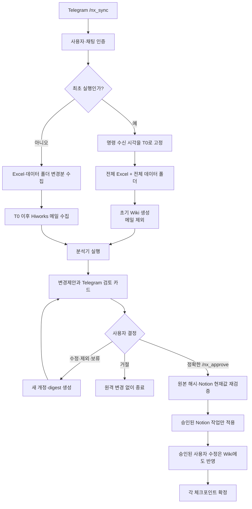

# 로컬 Excel → Notion 승인형 동기화

Hermes가 Telegram의 명시적 요청을 받아, 노트북의 읽기 전용 Excel 원본과 업무 자료를
분석하고 사용자가 정확히 승인한 변경만 Notion에 반영하는 Windows용 Python
프로젝트입니다. Excel은 사건 사실의 권위 있는 원본이며, LLM Wiki와 Hiworks 메일은
분석을 돕는 보조 자료입니다.

## 핵심 원칙

- 실행은 사용자가 Telegram으로 `/nx_sync`를 보낼 때만 시작합니다. cron은 사용하지
  않습니다.
- `source.mode`는 `local_filesystem`입니다. 원본 폴더와 원본 Excel은 읽기만 하며 저장,
  이름 변경, 이동, 삭제 또는 덮어쓰기를 하지 않습니다.
- 최초 기준시점 `T0`는 미리 정한 날짜가 아니라, 최초로 인증된 `/nx_sync` 명령을 받은
  시각입니다.
- `T0` 실행은 그 시점의 Excel 전체와 Notion 현재값을 대조해 기준선을 세우는 전체
  reconcile입니다. 기준선 자체를 과거 변경으로 간주하지 않으므로 속성별 `변경이력`은
  만들지 않으며, 이후 성공 기준선과 비교해 발견한 증분 변경부터 변경이력을 만듭니다.
- 최초 Wiki는 `T0`의 전체 Excel과 전체 데이터 원본 폴더만으로 만듭니다. 최초 구축에는
  메일을 넣지 않습니다.
- 이후 Wiki는 마지막 성공 체크포인트 이후의 Excel 변경분, 데이터 폴더 변경분, 그리고
  `T0` 이후 새로 수신한 Hiworks 메일을 반영합니다.
- 최초 구축 중 온라인 전용 파일은 설정에 따라 읽기 위해 내려받을 수 있습니다. 이후
  새로 발견된 온라인 전용 파일은 Telegram에서 별도로 승인하지 않으면 내려받지 않습니다.
- Wiki와 메일은 Notion 변경 권한을 주지 않습니다. Notion은 현재 제안의 ID, 개정번호,
  전체 digest와 정확한 변경 내용을 사용자가 Telegram에서 승인한 경우에만 변경합니다.
- 인증된 `/nx_sync`에는 즉시 `[NX_SYNC_ACCEPTED]`가 오고, 이미 실행 중이면
  `[NX_SYNC_IN_PROGRESS]`가 옵니다. 완료 결과는 `[NX_SYNC_PROPOSAL_READY]` 또는
  `[NX_SYNC_NO_CHANGES]`로 구분됩니다.
- 사용자가 제안을 수정하면 새 개정번호와 digest를 발급하며 이전 승인은 즉시 무효입니다.
- 원본 파일, 실제 설정, 토큰, 메일 원문, Wiki 산출물, 상태 DB와 감사 로그는 Git에
  포함하지 않습니다.

## 전체 흐름



## 분석 구조

변경된 행과 관련 문서를 분석기 레지스트리로 전달합니다. 기본 분석 영역은 사건 식별,
당사자, 그룹, 업무 상태, 기일, 실제 사건 비용, 정부지원사업 증빙, 등록결정 후속관리,
연락, 문서·자료, 관계 및 이상 탐지입니다. 알 수 없는 필드는 버리지 않고 검토 후보로
남깁니다.

비용과 증빙은 분리합니다.

- `actual_cost`: 실제 사건의 약정액, 관납료, 청구, 입금, 미수금 등을 분석합니다.
- `government_support_evidence`: 어떤 사건과 업무 결과를 어떤 정부지원사업에 얼마로
  증빙할지 분석합니다. 실제 비용을 읽기 전용 제약으로 참조하지만 덮어쓰지 않습니다.

분석기는 Notion writer를 직접 호출할 수 없습니다.

## LLM Wiki

Wiki는 설정한 로컬 출력 폴더에 세 층으로 구성됩니다.

1. Excel 사건 사실
2. 데이터 원본 폴더의 규정·절차·서식 등 참조 자료
3. `T0` 이후 Hiworks 메일의 분석 결과

Wiki는 원본과 완전히 분리된 파생물입니다. 원본 파일 자체를 복사해 공개 저장소에 넣지
않고, 세대별 manifest와 해시를 사용해 증분 상태를 추적합니다. 자세한 경계와 신뢰 규칙은
[LLM Wiki 운영 계약](docs/llm-wiki.md)을 참고하십시오.

`/nx_sync` 준비 중에는 로컬 상태 기록과 위 계약에 따른 Wiki 파생 세대 준비가 일어날 수
있습니다. 원본 폴더와 Excel, Notion, 그리고 사용자가 승인한 Wiki 오버레이는 변경하지
않습니다.

## Telegram 검토

검토 화면은 한 페이지에 5~10개 변경을 간략히 표시합니다.

- 사건번호
- 변경 근거
- 요약
- Notion 현재값 → 제안값
- Wiki 반영 여부

사용자는 항목을 적용, 수정, 제외 또는 보류할 수 있습니다. 모든 수정은 새 제안 개정과
digest를 만들며, 최종 반영에는 다음 형식의 별도 Telegram 메시지가 필요합니다.

```text
/nx_approve <proposal-id> <revision> <full-64-character-digest>
```

대규모 제안도 승인 경계를 완화하지 않습니다. 현재값은 대상 DB별로 묶어 읽되 모호한
제목이나 대상은 안전하게 실패시키고, 승인 뒤에는 모든 operation을 한 번 더 읽기 전용으로
검증한 다음 같은 Notion 페이지·안전 단계의 연속된 승인 속성만 한 요청으로 묶습니다.
제목 생성·변경과 후속 속성은 안전을 위해 별도 요청이 될 수 있습니다. 쓰기 도중 중단되면
outbox와 operation ID를 사용해 승인된 범위만 복구합니다.

검토 중 수정뿐 아니라 독립적인 사용자 정정 요청도 별도 제안으로 처리합니다. 원본은
바꾸지 않으며, 별도 승인을 받은 정정만 Notion과 Wiki의 승인 오버레이에 함께 반영합니다.
독립 정정 요청 형식은 다음과 같습니다.

```text
/nx_correct {"database":"한국 특허 사건","entity_key":"SS-SYNTHETIC-001","property":"현재상태","value":"보류","reason":"합성 예시 확인","case_number":"SS-SYNTHETIC-001"}
```

이 명령 자체는 읽기와 proposal 생성만 수행합니다. 이후 Gateway가 표시한 정확한
`/nx_approve`가 있어야 반영되며, 정정은 Excel 동기화 체크포인트를 전진시키지 않습니다.

## 빠른 시작

Python 3.11 이상과 이미 설정된 Hermes Gateway를 전제로 합니다.

```powershell
python -m venv .venv
.\.venv\Scripts\python -m pip install -e ".[dev]"
Copy-Item .\config\sync.example.json .\config\sync.local.json
```

`config\sync.local.json`에는 실제 값을 로컬에서만 입력합니다.

- `source.root_dir`: 읽기 전용 원본 폴더
- `source.excel_path`: 원본 폴더 안의 Excel
- `wiki.output_root`: 원본과 겹치지 않는 Wiki 출력 폴더
- `excel.sheets`, `excel.header_row`, 안정적인 key columns
- `notion.databases`: 검증된 database/data source ID
- `notion.schema_parent_page_id`: 별도 스키마 생성에만 쓰는 허용 상위 페이지 ID
- `approval.allowed_telegram_users`: 승인 가능한 숫자 사용자 ID
- `email`: Hiworks POP3 읽기 설정과 비밀키 이름

실제 경로와 식별자는 예제나 Git 추적 파일에 넣지 마십시오.

```powershell
.\.venv\Scripts\python -m notion_excel_sync.cli init-db `
  --config .\config\sync.local.json

.\.venv\Scripts\python -m notion_excel_sync.cli validate `
  --config .\config\sync.local.json
```

Notion 읽기 토큰은 보호된 Windows 자격 증명에 저장하고, 쓰기 토큰과 승인 서명 비밀은
Hermes Gateway의 보호된 실행 환경에만 둡니다. 모델 프로세스에는 쓰기 자격 증명을
전달하지 않습니다.

플러그인 설치·갱신 뒤에는 보호된 launcher 사본으로 Gateway를 재시작합니다. 이 단계는
Notion 쓰기 토큰을 마스킹 입력으로만 받고 파일이나 명령행에 저장하지 않습니다.

```powershell
& (Join-Path $env:LOCALAPPDATA `
  "hermes\secure-gateway-launcher\restart-hermes-gateway-secure.ps1") `
  -ProjectRoot $PWD
```

Notion 아래에 별도 스키마 생성이 필요한 경우에도 데이터 승인과 분리합니다.

```text
/nx_schema_plan government-support-evidence <NOTION_PARENT_PAGE_ID>
/nx_schema_show <schema-proposal-id> <revision>
/nx_schema_approve <schema-proposal-id> <revision> <full-64-character-digest>
```

생성 결과가 불명확하면 같은 승인으로 POST를 반복하지 않고, 화면에 표시된
`/nx_schema_recover` 명령으로 읽기 전용 복구 검증을 수행합니다.

## 문서

- [구현 아키텍처](docs/architecture.md)
- [설정 가이드](docs/configuration.md)
- [운영 가이드](docs/operations.md)
- [Telegram 명령](docs/telegram-commands.md)
- [LLM Wiki 운영 계약](docs/llm-wiki.md)

## 개발 검증

```powershell
.\.venv\Scripts\python -m pytest
.\.venv\Scripts\python -m ruff check .
```

실제 Notion 쓰기 검증은 테스트용 대상으로도 반드시 정확한 Telegram 승인 후에만
수행하십시오.
