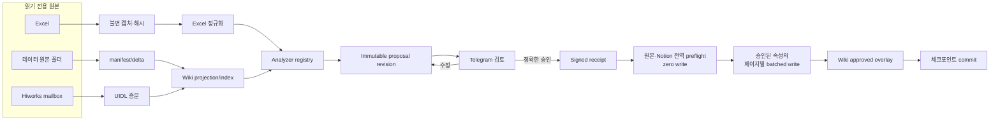

# 구현 아키텍처

## 경계와 책임

| 계층 | 책임 | 금지 |
|---|---|---|
| Hermes/Telegram | 명령 인증, 검토 카드 전송, 사용자 결정 수신 | 자연어를 승인으로 간주 |
| 로컬 원본 어댑터 | 원본 폴더와 Excel을 읽기 전용으로 캡처하고 SHA-256 계산 | 원본 저장·이동·삭제·이름 변경 |
| Excel 파서 | 지정 탭과 헤더를 안정 키 기준으로 정규화 | workbook 저장 |
| 데이터 폴더 수집기 | manifest 비교, 생성·수정·이동·삭제 후보 판정 | 원본 폴더 안에 상태 파일 작성 |
| Hiworks 수집기 | `T0` 이후 메일을 UIDL 기준으로 제한 수집 | 메일 삭제·전송, 최초 Wiki에 과거 메일 포함 |
| Wiki projector/index | Excel·자료·메일의 검증된 파생물을 별도 출력 폴더에 생성 | 원본 복사본을 Git 또는 프롬프트에 포함 |
| Analyzer registry | 그룹, 실제 비용, 증빙 등 타입화된 후보 생성 | Notion writer 직접 호출 |
| Proposal/approval | 제안 개정, digest, 편집·제외·보류, 1회용 영수증 | 이전 개정 승인 재사용 |
| Notion reader | 스키마와 현재값을 읽어 충돌 검사하고 대규모 조회는 DB별로 그룹화 | 승인 전 쓰기, 모호한 제목 추측 |
| Trusted writer | 전역 preflight 뒤 승인 영수증의 정확한 속성을 페이지별로 묶어 idempotent upsert | 승인되지 않은 속성·스키마 변경 |
| SQLite state | 분리된 체크포인트, proposal, outbox, audit | 실패한 실행에서 기준점 전진 |

## 데이터 흐름

## 최초 실행과 후속 실행

최초로 인증된 `/nx_sync` 이벤트를 받는 순간 `T0`를 한 번만 기록합니다.

초기 세대 `G0`:

1. 전체 Excel을 읽기 전용 캡처합니다.
2. 데이터 원본 폴더 전체 manifest를 만듭니다.
3. 설정이 허용하면 온라인 전용 파일을 읽기 위해 내려받습니다.
4. Excel과 데이터 폴더만으로 Wiki를 만듭니다.
5. 과거 메일은 포함하지 않습니다.
6. Excel 전체와 Notion 현재값을 reconcile해 기준선을 만들되, 기준선 자체의 속성별
   `변경이력` operation은 만들지 않습니다.
7. 최초 일괄 분석의 저신뢰 검토 후보는 로컬 감사 요약에 남기고, 신뢰도 `0.8` 이상인
   검토만 Notion 제안으로 구체화합니다.
8. 거부된 최초 제안 뒤 원본 버전이 바뀌면 승인되지 않은 구버전 검토 대기 작업만
   종료하고 최신 고신뢰 검토와 실질 동기화 작업은 유지합니다.

후속 세대 `Gn`:

1. 마지막 성공 Excel 해시와 현재 해시를 비교합니다.
2. 마지막 데이터 manifest와 현재 manifest의 변경분만 반영합니다.
3. `T0` 이후이며 아직 처리하지 않은 Hiworks UIDL만 반영합니다.
4. 후속 온라인 전용 파일은 별도 Telegram 승인 없이는 내려받지 않습니다.
5. 승인된 사용자 정정은 원본이 아니라 Wiki 오버레이에 기록합니다.
6. 마지막 성공 기준선과 비교해 확인한 속성 변경만 `변경이력`으로 만듭니다.

최초 reconcile도 실제 Notion 변경이 포함되면 후속 실행과 똑같이 proposal revision,
전체 digest와 별도 Telegram 승인이 필요합니다.

## 읽기 및 쓰기 확장성

- 인증된 `/nx_sync`는 즉시 `[NX_SYNC_ACCEPTED]`를 반환하고, 기존 실행이 있으면 새
  실행을 만들지 않은 채 `[NX_SYNC_IN_PROGRESS]`를 반환합니다.
- 완료 결과는 `[NX_SYNC_PROPOSAL_READY]` 또는 `[NX_SYNC_NO_CHANGES]`로 구분합니다.
- Notion 현재값을 많이 읽을 때는 대상 DB별 조회 결과로 정확한 제목 인덱스를 만듭니다.
  이미 매핑된 페이지는 정확한 page binding을 검증하고, 중복 제목처럼 결과가 모호하면
  fail closed합니다.
- `/nx_approve` 뒤에도 모든 operation의 원본 해시, schema, 현재값과 인코딩을
  zero-write 전역 preflight로 먼저 검사합니다.
- preflight가 모두 성공한 뒤에만 같은 페이지·안전 단계에서 연속된 승인 property를 한
  페이지 update로 묶습니다. 제목 생성·변경과 후속 property는 별도 요청이 될 수 있습니다.
  각 property operation은 여전히 승인된 revision과 digest에 개별적으로 포함됩니다.

## 체크포인트

하나의 시각이나 버전을 모든 입력에 공용으로 쓰지 않습니다.

- `wiki-bootstrap`: `T0`, 초기 세대 완료 여부
- `wiki-excel`: 마지막 성공 Excel 해시와 세대
- `wiki-data-folder`: 마지막 성공 manifest와 세대
- `email-hiworks`: 마지막 성공 UIDL/Message-ID 집합
- `notion`: 마지막 완전 성공 proposal의 원본 해시와 대상 상태
- `user-decision`: 승인·수정·제외·보류 이력

각 체크포인트는 그 출력이 완전히 확정된 뒤에만 이동합니다. 거절, 만료, stale, 부분 실패는
Notion 체크포인트를 이동시키지 않습니다.

## 동시성과 실패 복구

- 같은 원본과 대상 범위에는 DB-backed lease를 사용합니다.
- 첫 Notion 쓰기 전 모든 operation의 전역 preflight를 끝내고, nonce를 소비한 뒤
  outbox를 만듭니다.
- 각 operation ID는 idempotency key입니다.
- 페이지별 batch에도 포함된 operation ID 집합을 기록합니다.
- `APPLYING` 중 중단되면 완료된 operation을 확인하고 동일한 영수증과 정확히 같은
  나머지 범위만 재조정합니다. 프로세스 재시작으로 승인 비밀이 회전했으면 살아 있는
  apply lease가 없고 저장된 영수증·nonce·outbox 범위가 모두 일치할 때만
  `/nx_recover`가 읽기 전용 복구 제안을 만듭니다.
- 원본 해시나 Notion precondition이 달라지면 `STALE`로 끝내고 새 분석과 승인을 요구합니다.
- Wiki 세대는 임시 위치에서 완전 검증한 뒤 원자적으로 현재 포인터를 바꿉니다.

`/nx_sync` 준비 전에는 원본과 Notion이 바뀌지 않습니다. 준비 중 쓰일 수 있는 로컬
영역은 runtime 상태와 LLM Wiki 운영 계약에 따른 파생 세대뿐이며, 사용자 승인
오버레이는 Notion 성공 뒤에만 바뀝니다.

## 보안 모델

읽기 단계와 쓰기 단계를 프로세스·자격 증명으로 분리합니다. Hermes 모델 프로세스는
Notion 쓰기 토큰이나 승인 서명 비밀을 받지 않습니다. 데이터 문서와 메일 본문은 신뢰할 수
없는 입력이며 그 안의 명령, 링크 또는 지침을 실행하지 않습니다.

공개 저장소에는 코드와 일반화된 예제만 둡니다. 실제 원본, Wiki 출력, 메일 원문, 로컬
설정, 상태 DB, 로그, 토큰과 운영 식별자는 추적하지 않습니다.
